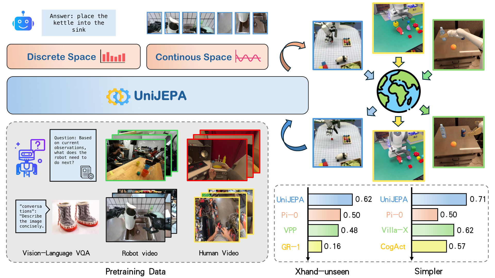

<div align="center">
<h2><center>👉 UniJEPA: Enhancing Robot Policy via Unified Continuous and Discrete Representation Learning</h2>

<p>
  <a href="https://scholar.google.com/citations?user=6is33pIAAAAJ&hl=zh-CN">Jianke Zhang</a>,
  <a href="https://scholar.google.com/citations?user=WamdPtwAAAAJ&hl=zh-CN">Yucheng Hu</a>,
  <a href="">Yanjiang Guo</a>,
  <a href="">Xiaoyu Chen</a>,
  <a href="">Yichen Liu</a>,
  <a href="">Wenna Chen</a>,
  <a href="">Chaochao Lu</a>,
  <a href="">Jianyu Chen</a>
</p>

<a href='https://arxiv.org/abs/2510.10642'></a>
<a href='https://doi.org/10.48550/arXiv.2510.10642'></a>
<a href='https://sites.google.com/view/unijepa1'></a>

</div>

<div align=center>

</div>

UniJEPA first employ Jepa-style world-moding under latent feature space into VLA domain. It unifies continuous control representation and discrete semantic representation for robot policy learning.  
This repository includes complete **Bridge** and **Fractal** training + SimplerEnv evaluation workflows.

## Installation 🛠️

```bash
git clone <your_repo_url>
cd UniJEPA-public
uv sync
```

Login W&B:

```bash
wandb login <your_wandb_key>
```

If you evaluate in SimplerEnv:

```bash
cd ..
git clone https://github.com/allenzren/SimplerEnv --recurse-submodules
cd UniJEPA-public
uv pip install -e ../SimplerEnv
uv pip install -e ../SimplerEnv/ManiSkill2_real2sim
```

## Environment Setup

```bash
export VLA_DATA_DIR=/path/to/datasets
export VLA_LOG_DIR=/path/to/logs
export TRANSFORMERS_CACHE=/path/to/hf_cache
export VLA_WANDB_ENTITY=<your_wandb_entity>
```

Download PaliGemma backbone:

```bash
cd $TRANSFORMERS_CACHE
git clone https://huggingface.co/google/paligemma-3b-pt-224
```

## Data Preparation

### Bridge / Fractal Data

1. Put dataset under `$VLA_DATA_DIR`.
2. Preprocess/resize data to 224:

```bash
bash slurm/modify_rlds.sh
```

3. Check training configs:
- `config/train/bridge.yaml`
- `config/train/fractal.yaml`

### Paths You Need To Modify

- `VLA_DATA_DIR`, `VLA_LOG_DIR`, `TRANSFORMERS_CACHE`
- `checkpoint_path` in eval commands/scripts
- Optional mirror endpoints in `scripts/run.py` (`HF_ENDPOINT`, `WANDB_BASE_URL`)
- Optional `dino_model_path` if your setup requires explicit DINO checkpoint path

## Train UniJEPA 🛸

### 🛸 Bridge Training

```bash
bash slurm/train_unijepa_bridge.sh
```

### 🛸 Fractal Training

```bash
bash slurm/train_unijepa_fractal.sh
```

## Evaluation 📊

### 📊 Bridge Eval (Simpler)

```bash
bash slurm/eval_simpler_bridge.sh
```

### 📊 Fractal Eval (Simpler)

```bash
bash slurm/eval_simpler_fractal.sh
```

## Bibtex

🌟 If you find this project useful, please cite:

```bibtex
@article{zhang2025unijepa,
  title={UniJEPA: Enhancing Robot Policy via Unified Continuous and Discrete Representation Learning},
  author={Zhang, Jianke and Hu, Yucheng and Guo, Yanjiang and Chen, Xiaoyu and Liu, Yichen and Chen, Wenna and Lu, Chaochao and Chen, Jianyu},
  journal={arXiv preprint arXiv:2510.10642},
  year={2025}
}
```

## Acknowledgments

This work is based on open-pi-zero style VLA design and related open-source projects, including Pi0, OpenVLA/Octo/dlimp/OXE tooling, PaliGemma implementations, and SimplerEnv ecosystem.
